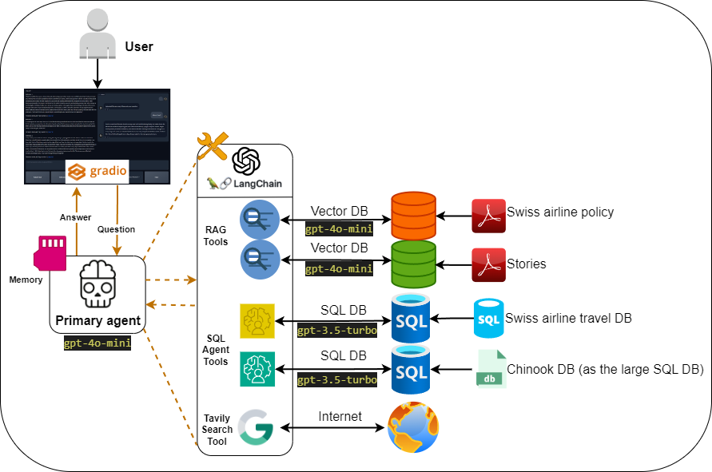
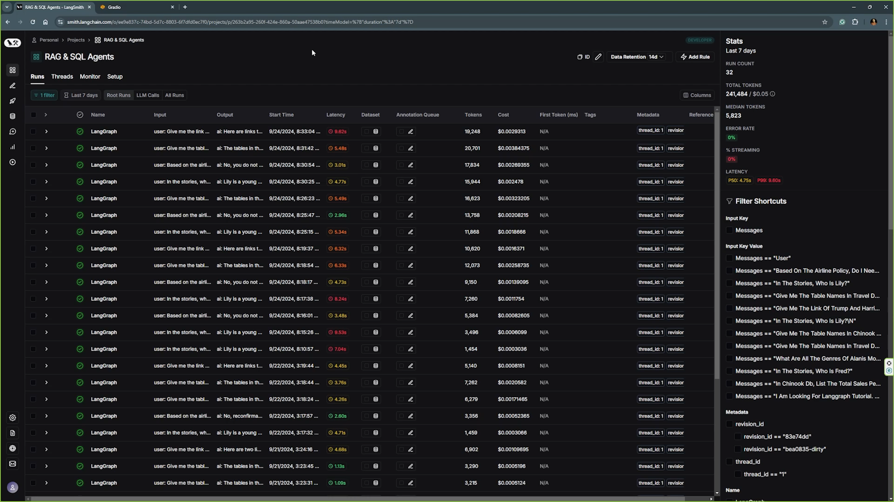

# Ask-Your-Database-3.0 – AI Chatbot with Intelligent Tool Selection  

## Overview  
Ask-Your-Database-3.0 is an AI-powered chatbot that intelligently selects the right tool—retrieving information from documents, querying SQL databases, or searching the web—based on user queries. It enables seamless natural language interaction with structured and unstructured data, ensuring relevant and accurate responses.  

## Features  
- **Retrieval-Augmented Generation (RAG)**: Stores and retrieves unstructured PDFs and documents using [ChromaDB](https://github.com/chroma-core/chroma) as a vector database, providing context-aware responses.  
- **SQL Query Generation**: Converts natural language queries into SQL, retrieves data from linked databases, and presents results in a human-readable format.  
- **Real-Time Web Search**: Integrates online search to answer queries beyond the chatbot’s existing knowledge or available datasets.  
- **Dynamic Tool Selection**: Automatically determines the best method (document retrieval, SQL query, or web search) based on user input.  

The chatbot is built using **OpenAI, LangChain, LangGraph, LangSmith, and Gradio**, with **LangSmith** used for monitoring agent performance.

---

## System Requirements
- **Operating System:** Linux or Windows (**Tested on Windows 11 with Python 3.9.11**)
- **OpenAI API Key:** Required for **GPT functionality**.
- **Tavily API Key:** Required for **search tools** (**Free from Tavily profile**).
- **LangChain API Key:** Required for **LangSmith monitoring** (**Free from LangChain profile**).
- **Dependencies:** Provided in the `requirements.txt` file.

---

## Installation and Execution

### **1. Clone the Repository**
```
git clone <repo_address>
```

### **2. Create and Activate a Virtual Environment**
```
python -m venv venv
```

#### **On Windows:**
```
venv\Scripts\activate
```

#### **On Linux/macOS:**
```
source venv/bin/activate
```

### **3. Install Dependencies**
```
pip install -r requirements.txt
```

### **4. Download and Add SQL Databases**
- **Travel SQL Database:** Download from [Kaggle](https://www.kaggle.com/code/mpwolke/airlines-sqlite) and place it in the `data` folder.
- **Chinook SQL Database:** Download from [this link](https://database.guide/2-sample-databases-sqlite/) and place it in the `data` folder.

### **5. Configure API Keys**
Prepare the `.env` file and add:
```
OPEN_AI_API_KEY=<your_key>
TAVILY_API_KEY=<your_key>
LANGCHAIN_API_KEY=<your_key>
```

### **6. Prepare Vector Databases**
Run the following command **once** to set up the vector databases:
```
python src/prepare_vector_db.py
```

### **7. Start the Chatbot**
Launch the chatbot by running:
```
python src/app.py
```

Open the **Gradio URL** generated in the terminal to start chatting.

---

## Using Your Own Database

### **1. Add Your Data**
- Place your **SQL, CSV, or XLSX** files in the `data` folder.

### **2. Configure the Database Connection**
- Update `tools_config.yml` with your database settings.

### **3. Load the Configurations**
- Ensure configurations are correctly loaded in:
  - `src/agent_graph/load_tools_config.py`
  - `src/chatbot/load_config.py`

### **4. Prepare Vector Databases for RAG**
```
python src/prepare_vector_db.py
```

After setup, the agents can interact with the databases or new agents can be created.

---

## Project Schemas

### **High-Level Overview**
<div align="center">
  
</div>

### **Detailed Schema**
<div align="center">
  
</div>

### **Graph Schema**
<div align="center">
  
</div>

### **SQL-Agent Strategies for Large Databases**
<div align="center">
  
</div>

---

## Chatbot User Interface
<div align="center">
  
</div>

---

## LangSmith Monitoring System
<div align="center">
  
</div>

---

## Databases Used
- **Travel SQL Database:** [Kaggle Link](https://www.kaggle.com/code/mpwolke/airlines-sqlite)
- **Chinook SQL Database:** [Sample Database](https://database.guide/2-sample-databases-sqlite/)
- **Stories VectorDB**
- **Airline Policy FAQ VectorDB**

---

## Key Frameworks and Libraries
- **LangChain:** [Introduction](https://python.langchain.com/docs/get_started/introduction)
- **LangGraph**
- **LangSmith**
- **Gradio:** [Documentation](https://www.gradio.app/docs/interface)
- **OpenAI API:** [Developer Quickstart](https://platform.openai.com/docs/quickstart?context=python)
- **Tavily Search**
